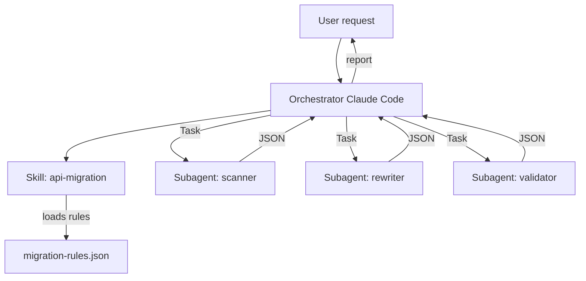
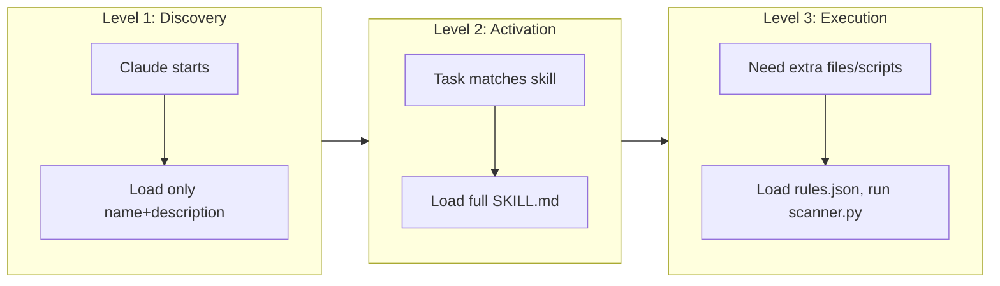

# Architecture of MigraAPI

MigraAPI follows the **orchestrator pattern** where a main agent (Claude Code) delegates tasks to isolated subagents. The system leverages **progressive disclosure** to manage context efficiently.

## Overall flow

## Progressive Disclosure (3 levels)

## Subagent isolation

Each subagent runs in its own context window. The main agent never sees the full source code of scanned files – only the structured JSON output. This keeps the main context small and allows parallel execution.

## Parallel execution

The orchestrator can launch multiple `scanner` subagents in parallel (one per file). Results are aggregated. Similarly, `rewriter` and `validator` can run in parallel on independent files.

## Allowed tools

- **scanner**: `Read`, `Grep`, `Glob` (read-only)
- **rewriter**: `Read`, `Write`, `Edit` (modify files)
- **validator**: `Read`, `Bash`, `Grep` (run syntax checks)

This follows the principle of least privilege.

For more details, see the [Subagents page](subagents.md).
